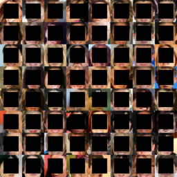
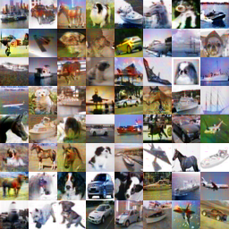
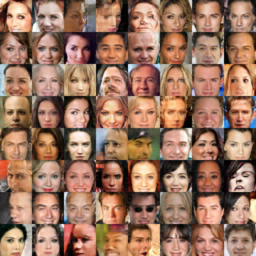
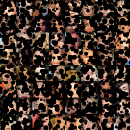
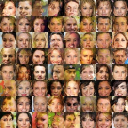

# Solving inverse problems using a DCGAN in Tensorflow

Based on work from my [Part III essay](https://drive.google.com/open?id=1V5S_EPCBNptCq54BXGLzbgWr2sGbvwHX), 
I designed framework that is based on a GAN
and can solve various inverse problems on pictures.
Some examples are below.

The code is based on the code from Taehoon Kim's DCGAN-tensorflow project: 
https://github.com/carpedm20/DCGAN-tensorflow

## Center inpainting
The architecture can be trained to recreate the center part of a picture.
The code below was used to train the model that created the following picture:
The model was trained using the following line:

    $ python main.py --crop --train_size 60000 --problem_name problems.center_inpainting --nrof_epochs 16 --train
    

## Colouring
I also trained the model to colour black and white pictures.
The dataset I used for the following was a subset of (5 of the classes of) the cifar10 dataset.

    $ python main.py --problem_name problems.colouring_bw --dataset_name cifar10 --nrof_epochs 16 --train

    

## Upsampling
Pictures are below. It should be noted though that this (and the other results) were trained and evaluated
on pictures centered before downsampling. This makes the task easier than usual.

    $ python main.py --crop --train_size 60000 --problem_name problems.upsampling --nrof_epochs 16 --train
    

## Picture extension
When the model is trained with the right hyperparameters, 
the special feature of this framework is that it does't only create one solution to the corresponding problem,
but a whole distribution of possible solutions, as shown in the following picture: 
(to produce the result the (usually random) vector z was varied with the same input.) 

    python main.py --problem_name problems.upper_inpainting --dataset_name mnist --g_feature_dim 10 --train

## Flexible inpainting
I also trained the model to do flexible inpainting,
where the missing parts of the picture are not known in advance of training and are different for each picture.<br\>
Furthermore results are still not close to looking natureal, work in progress.

    python main.py --crop --train_size 60000 --problem_name problems.flexible_inpainting --epoch=8 --train

